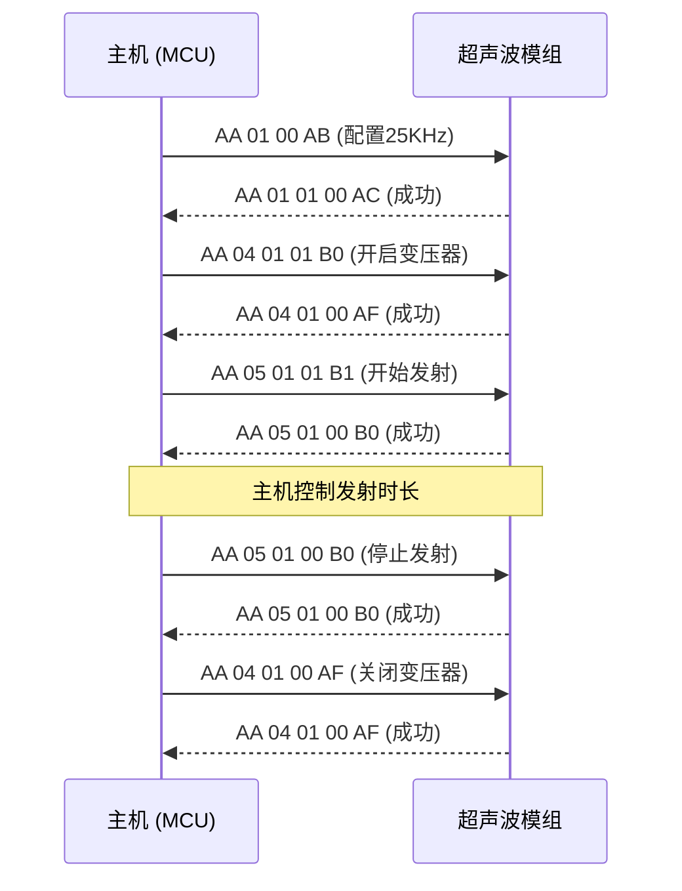

# UART 超声波模组通信协议

## 1. 概述

本文档定义主机（MCU）与超声波模组之间的 UART 通信协议。主机通过串口向模组下发配置和发射指令，模组执行后返回应答帧。

- **物理层**：UART，3.3V TTL 电平
- **波特率**：115200 bps
- **数据位**：8
- **停止位**：1
- **校验位**：无
- **通信方式**：半双工，主机主动发送请求，模组回复应答

---

## 2. 通用约定

### 2.1 帧格式

所有指令和应答均采用定长或变长帧，结构如下：

| 偏移  | 长度(字节) | 字段    | 说明                                                             |
| ----- | ---------- | ------- | ---------------------------------------------------------------- |
| 0     | 1          | `HEAD`  | 帧头，固定 `0xAA`                                                |
| 1     | 1          | `CMD`   | 命令字，见 §3                                                    |
| 2     | 1          | `LEN`   | 数据区长度（0 ~ 32），不含 HEAD/CMD/LEN/CHECK                    |
| 3     | LEN        | `DATA`  | 数据区，内容依赖 CMD                                             |
| 3+LEN | 1          | `CHECK` | 校验和 = `HEAD` + `CMD` + `LEN` + `DATA` 各字节累加和，取低 8 位 |

### 2.2 应答帧格式

模组对每个有效指令回复一个应答帧：

| 偏移 | 长度(字节) | 字段     | 说明                 |
| ---- | ---------- | -------- | -------------------- |
| 0    | 1          | `HEAD`   | 帧头，固定 `0xAA`    |
| 1    | 1          | `CMD`    | 命令字，与请求帧相同 |
| 2    | 1          | `LEN`    | `0x01`               |
| 3    | 1          | `STATUS` | 执行状态             |
| 4    | 1          | `CHECK`  | 校验和               |

`STATUS` 取值：

| 取值   | 含义     | 说明                             |
| ------ | -------- | -------------------------------- |
| `0x00` | 成功     | 指令已正确执行                   |
| `0x01` | 失败     | 指令执行失败，参数或硬件异常     |
| `0x02` | 无效命令 | `CMD` 值未定义或当前状态下不支持 |

### 2.3 超时与重试

- 主机发送请求后，应在 **100 ms** 内收到应答，否则视为超时。

---

## 3. 指令定义

### 3.1 配置超声波发射频率为 25KHz

**用途**：将模组超声波发射频率设置为 25KHz 单频模式。

**调用方 / 前置条件**：模组空闲或已停止发射。

**请求**：

| 字段  | 值     | 说明                    |
| ----- | ------ | ----------------------- |
| HEAD  | `0xAA` |                         |
| CMD   | `0x01` |                         |
| LEN   | `0x00` | 无数据区                |
| CHECK | `0xAB` | `0xAA+0x01+0x00 = 0xAB` |

**应答**：通用应答帧（见 §2.2），`CMD=0x01`。

**示例**：

```
请求： AA 01 00 AB
应答： AA 01 01 00 AC
```

---

### 3.2 配置超声波发射频率为 30KHz

**用途**：将模组超声波发射频率设置为 30KHz 单频模式。

**调用方 / 前置条件**：模组空闲或已停止发射。

**请求**：

| 字段  | 值     | 说明                    |
| ----- | ------ | ----------------------- |
| HEAD  | `0xAA` |                         |
| CMD   | `0x02` |                         |
| LEN   | `0x00` | 无数据区                |
| CHECK | `0xAC` | `0xAA+0x02+0x00 = 0xAC` |

**应答**：通用应答帧（见 §2.2），`CMD=0x02`。

**示例**：

```
请求： AA 02 00 AC
应答： AA 02 01 00 AD
```

---

### 3.3 配置超声波发射频率为 25KHz + 30KHz

**用途**：将模组超声波发射频率设置为 25KHz 和 30KHz 混合模式（双频交替或同时输出，视模组硬件能力而定）。

**调用方 / 前置条件**：模组空闲或已停止发射。

**请求**：

| 字段  | 值     | 说明                    |
| ----- | ------ | ----------------------- |
| HEAD  | `0xAA` |                         |
| CMD   | `0x03` |                         |
| LEN   | `0x00` | 无数据区                |
| CHECK | `0xAD` | `0xAA+0x03+0x00 = 0xAD` |

**应答**：通用应答帧（见 §2.2），`CMD=0x03`。

**示例**：

```
请求： AA 03 00 AD
应答： AA 03 01 00 AE
```

---

### 3.4 开启 / 关闭超声波变压器

**用途**：控制超声波变压器高压输出的通断。发射超声波前需先开启变压器。

**调用方 / 前置条件**：无。

**请求**：

| 字段    | 值              | 说明                                     |
| ------- | --------------- | ---------------------------------------- |
| HEAD    | `0xAA`          |                                          |
| CMD     | `0x04`          |                                          |
| LEN     | `0x01`          | 数据区长度为 1                           |
| DATA[0] | `0x00` ~ `0x01` | `0x00` = 关闭变压器，`0x01` = 开启变压器 |
| CHECK   | 计算结果        | 整帧校验和                               |

**应答**：通用应答帧（见 §2.2），`CMD=0x04`。

**示例**：

```
开启变压器：
请求： AA 04 01 01 B0
应答： AA 04 01 00 AF

关闭变压器：
请求： AA 04 01 00 AF
应答： AA 04 01 00 AF
```

---

### 3.5 发射超声波

**用途**：控制超声波发射的开启与关闭。模组按当前配置的频率（由 §3.1 / §3.2 / §3.3 设置）持续发射，直到主机下发关闭指令。发射时长完全由主机控制。

**调用方 / 前置条件**：开启发射前需先通过 §3.4 开启变压器。

**请求**：

| 字段    | 值              | 说明                                 |
| ------- | --------------- | ------------------------------------ |
| HEAD    | `0xAA`          |                                      |
| CMD     | `0x05`          |                                      |
| LEN     | `0x01`          | 数据区长度为 1                       |
| DATA[0] | `0x00` ~ `0x01` | `0x00` = 停止发射，`0x01` = 开始发射 |
| CHECK   | 计算结果        | 整帧校验和                           |

**应答**：通用应答帧（见 §2.2），`CMD=0x05`。

**示例**：

```
开始发射：
请求： AA 05 01 01 B1
应答： AA 05 01 00 B0

停止发射：
请求： AA 05 01 00 B0
应答： AA 05 01 00 B0
```

---

## 4. 典型使用流程



---

## 5. 完整指令速查表

| 功能         | CMD    | LEN    | DATA                     | 说明                     |
| ------------ | ------ | ------ | ------------------------ | ------------------------ |
| 配置 25KHz   | `0x01` | `0x00` | 无                       | 发射频率设为 25KHz       |
| 配置 30KHz   | `0x02` | `0x00` | 无                       | 发射频率设为 30KHz       |
| 配置 25K+30K | `0x03` | `0x00` | 无                       | 发射频率设为 25KHz+30KHz |
| 控制变压器   | `0x04` | `0x01` | `0x00`=关, `0x01`=开     | 开启/关闭变压器          |
| 发射超声波   | `0x05` | `0x01` | `0x00`=停止, `0x01`=发射 | 开始/停止超声波发射      |

---

## 6. 错误处理

| 异常场景                        | 行为                 | 应答 STATUS       |
| ------------------------------- | -------------------- | ----------------- |
| 帧头错误 (`HEAD != 0xAA`)       | 模组丢弃该帧，无应答 | —                 |
| 校验和不匹配                    | 模组丢弃该帧，无应答 | —                 |
| CMD 未定义                      | 回复错误应答         | `0x02` (无效命令) |
| 数据区长度与 CMD 不匹配         | 回复错误应答         | `0x01` (失败)     |
| 发射指令(DATA=开)但变压器未开启 | 回复错误应答         | `0x01` (失败)     |

---

## 7. 附录

### 7.1 校验和计算参考 (C语言)

```c
uint8_t calc_checksum(const uint8_t *buf, uint8_t len)
{
    uint8_t sum = 0;
    for (uint8_t i = 0; i < len; i++) {
        sum += buf[i];
    }
    return sum;
}
```

### 7.2 组包参考 (C语言)

```c
void build_request(uint8_t cmd, const uint8_t *data, uint8_t data_len, uint8_t *frame)
{
    frame[0] = 0xAA;        // HEAD
    frame[1] = cmd;         // CMD
    frame[2] = data_len;    // LEN
    for (uint8_t i = 0; i < data_len; i++) {
        frame[3 + i] = data[i];
    }
    frame[3 + data_len] = calc_checksum(frame, 3 + data_len);
}
```
