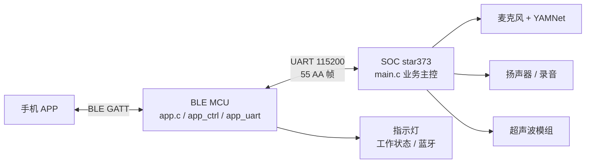
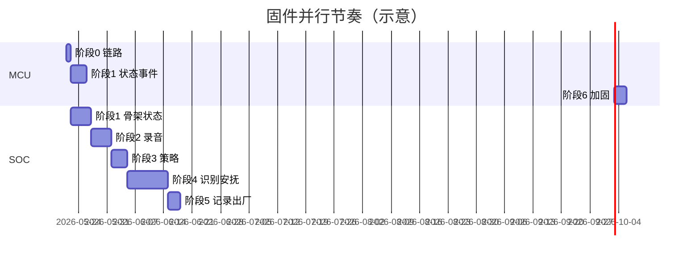

# 蛋安抚器设备固件开发流程

> 本文档基于 [蛋安抚器产品定义.md](../蛋安抚器产品定义.md)、[BLE_UART接口设计_V1.md](./BLE_UART接口设计_V1.md) 与当前 `ble_egg_anfu` 工程现状整理。  
> 目标：明确 **MCU（TLSR8258）** 与 **SOC（星宸 373 / star373）** 的分工、实施顺序与验收标准，按步骤推进直至满足产品定义。

---

## 1. 系统架构与职责



| 层级    | 入口文件                       | 职责                                                                                        |
| ------- | ------------------------------ | ------------------------------------------------------------------------------------------- |
| **APP** | —                              | 配对、状态展示、录音/安抚设置、日志拉取、解绑恢复出厂                                       |
| **MCU** | `app.c`                        | BLE 协议栈、电源/指示灯、UART 桥接、将 APP 命令转发 SOC、将 SOC 事件/状态转成 BLE RSP/EVENT |
| **SOC** | `soc/star373/main.c`（待建设） | 吠叫识别、安抚状态机、音频录放、超声波、策略与记录持久化、UART 业务实现                     |

**原则（与接口文档一致）**

- 协议以 `docs/BLE_UART接口设计_V1.md` 为唯一事实标准；改协议先改文档再改代码。
- MCU 尽量做「薄网关」：除 `POWER`、LED、蓝牙连接态等本地能力外，业务状态以 SOC 为准。
- SOC 的 `main.c` 负责**进程/线程级编排**；子模块按功能拆分（见第 4 节）。

---

## 2. 需求要点 → 固件映射

摘自产品定义，仅列**嵌入式需实现**部分。

| 产品能力                            | 主实现方                        | 关键模块 / 接口                   |
| ----------------------------------- | ------------------------------- | --------------------------------- |
| 7×24 吠叫识别，10~15s 监测周期      | SOC                             | YAMNet 推理 + 周期计数策略        |
| 自动/人工安抚顺序、成功后调序       | SOC                             | `bark_control` / 策略存储         |
| 安抚音乐 2min、主人录音、超声 5s×3  | SOC                             | `audio`、超声驱动                 |
| 60s 休息                            | SOC                             | 状态机 `RESTING`                  |
| 主人录音 3~10s、试听/删除           | SOC + MCU 转发                  | `OWNER_REC_*` UART/BLE            |
| 音量、安抚模式/措施配置             | SOC 持久化 + MCU 缓存同步       | `CALM_STRATEGY_*`、`VOLUME_*`     |
| 安抚记录（近 30 天 / 协议近 16 条） | SOC 存储 + MCU 分页拉取         | `CALM_RECORD_GET`                 |
| 恢复出厂（解绑）                    | SOC 清数据 + MCU 清绑定         | `FACTORY_RESET`                   |
| 工作状态灯 / 蓝牙灯                 | MCU                             | `app_ui.c` + SOC `workState` 事件 |
| APP 开关机                          | MCU 维护 `powerState`，通知 SOC | `POWER_SET` / `SOC_POWER_CTRL`    |
| 时间同步                            | SOC 系统时间 + MCU 秒级缓存     | `TIME_SET`                        |

---

## 3. 当前工程状态（基线评估）

### 3.1 MCU（`ble_egg_anfu/`，Telink B80）

| 模块         | 状态         | 说明                                                                                   |
| ------------ | ------------ | -------------------------------------------------------------------------------------- |
| `app.c`      | ✅ 已集成     | `user_init_normal` 调用 `app_uart_init`、`app_ctrl_init`；`main_loop` 跑 UART/时间/LED |
| `app_uart.c` | ✅ 基础完成   | 帧封装/解析、`send_cmd_with_cb`、EVT 分发；**缺 pending 超时清理**                     |
| `app_ctrl.c` | ✅ 大部分完成 | BLE 命令分发；查询/设置类多数已 `wait SOC RSP`                                         |
| `app_ui.c`   | ⚠️ 待对齐     | 需按产品定义 5 种工作状态 + 蓝牙灯规则驱动 GPIO                                        |
| SOC 事件上行 | ⚠️ 部分       | 仅注册 `0x84 OWNER_REC_EVT`；**未注册** `0x80~0x83` 工作状态/安抚过程事件              |

### 3.2 SOC（`soc/star373/`，软链至 WSL `Ifado_IMSSV03C12/SourceCode`）

> 软链：`\\wsl.localhost\Ubuntu-22.04\home\xh\code\star373\Ifado_IMSSV03C12\SourceCode`（含 `sdk/`、`project/`、`boot/`、`kernel/`）。  
> 吠叫识别样例：`sdk/verify/sample_code/source/ifado/audio/dog_soother/`。

| 模块                                  | 状态       | 说明                                                                 |
| ------------------------------------- | ---------- | -------------------------------------------------------------------- |
| `vendor/.../soc/star373/main.c`       | ❌ 待建     | **产品入口**（与软链并列维护）；可参考 sample_code 内各 star373 demo |
| `dog_soother` 下 `test_yamnet` 等     | ✅ 算法样例 | 16kHz 滑窗推理；可抽为 `bark_detect` 模块                            |
| `uart/demo.c`（样例树内）             | 🔧 参考     | TTY 读写 demo，非业务协议                                            |
| `uart_ble` / `bark_control` / `audio` | ❌ 待新建   | 曾在 RV1103 `rkipc` 路径试验；需在 star373 产品工程内重写            |

### 3.3 文档与工具

| 资产         | 路径                          |
| ------------ | ----------------------------- |
| 接口总设计   | `docs/BLE_UART接口设计_V1.md` |
| APP 对接摘要 | `ctrl_service_doc.md`         |
| 联调上位机   | `scripts/visializable.py`     |
| 进度日记     | `docs/PROJECT_JOURNAL.md`     |

---

## 4. SOC 目录结构（已落地）

**工程路径**：`soc/star373/sdk/verify/sample_code/source/ifado/audio/dog_soother/`  
详细说明见该目录下 `MODULE_STRUCTURE.md`。

```
dog_soother/
  main.c
  app/           app_main.c/h      — 初始化与主循环
  include/       app_config.h, app_types.h, uart_cmd.h, log.h
  uart/          uart_proto, uart_dispatch
  bark/          bark_detect, bark_control
  media/         audio, ultrasonic
  store/         comfort_store
  sys/           system_time
  yamnet/        YAMNet 推理库
  legacy/        test_yamnet.c（算法参考，默认不链接）
  tools/         uart_tty_demo.c（TTY 参考，默认不链接）
```

构建产物：`out/arm/app/dog_soother`（`make source/ifado/audio/dog_soother`）。

MCU 侧 `app_uart.h` 中 `UART_SOC_*` 命令字已与文档一致，SOC 实现时**禁止私自改 cmdId**。

---

## 5. 分阶段实施步骤

以下步骤按依赖排序；每步结束应能在上位机或 APP 上**可演示、可验收**。  
（编译/烧录由开发者在本地执行，本文不代跑构建。）

---

### 阶段 0：环境与链路确认（0.5~1 天）

**目标**：确认双芯片 UART 物理互通，文档与 MCU 命令字一致。

| 序号 | 任务                                                                                                                       | 负责 | 验收                     |
| ---- | -------------------------------------------------------------------------------------------------------------------------- | ---- | ------------------------ |
| 0.1  | 确认 MCU `PC1/PC0` ↔ SOC `tty`（文档写 `/dev/ttyS5`，star373 demo 默认 `ttyS1`，以原理图/内核为准统一写进 `app_config.h`） | 双方 | 双向收发固定测试帧       |
| 0.2  | SOC 用 `uart/demo.c` 或临时 echo 验证 115200 8N1                                                                           | SOC  | 与 MCU 串口日志一致      |
| 0.3  | 核对 `app_uart.h` 与 `BLE_UART接口设计_V1.md` 第 4 章 cmdId 一致                                                           | MCU  | 差异列表为空或已更新文档 |

---

### 阶段 1：SOC 最小骨架 + 状态闭环（3~5 天）

**目标**：`main.c` 跑起来；`STATUS_GET` / `WORK_STATE` 端到端可用。

| 序号 | 任务                                                                                     | 文件                     | 验收                                           |
| ---- | ---------------------------------------------------------------------------------------- | ------------------------ | ---------------------------------------------- |
| 1.1  | 新建 `main.c`：`uart_proto` 初始化、接收线程/主循环                                      | `main.c`, `uart_proto.*` | SOC 独立进程启动无崩溃                         |
| 1.2  | 实现 `0x11 SOC_STATUS_GET` RSP：`workState, ownerVoiceExist, volume, calmMode, masks...` | `uart_dispatch.c`        | 上位机发 BLE `0x13` 得到非超时响应             |
| 1.3  | 实现 `0x80 SOC_WORK_STATE_EVT`：状态变化时主动上报                                       | 同上                     | MCU 转发 BLE `0x80`（需在阶段 1 末同步改 MCU） |
| 1.4  | MCU：注册 `0x80` EVT handler，更新 `g_ctrlState.workState` 并 `app_ctrl` 发 EVENT        | `app_ctrl.c`             | APP/visializable 看到状态切换                  |
| 1.5  | MCU：`app_ui` 按 `workState`/`powerState`/连接态驱动指示灯                               | `app_ui.c`               | 对照产品定义灯态表                             |

**状态机初版（SOC）**

```
MONITORING → IDENTIFYING → ACTING → RESTING(60s) → MONITORING
     ↑           （识别周期 10~15s）      （多步安抚）      ↓
   OFF（关机）←──────────────────────────────────────────┘
```

---

### 阶段 2：录音与播放闭环（3~5 天）

**目标**：主人录音全流程与产品 3~10s 规则一致。

| 序号 | 任务                                                                          | 验收                                          |
| ---- | ----------------------------------------------------------------------------- | --------------------------------------------- |
| 2.1  | SOC：`0x20 START` / `0x21 STOP`，写 `/userdata/owner.pcm`，校验时长           | STOP 后 `0x24 INFO_GET` 返回 exist + duration |
| 2.2  | SOC：录音 ≥10s 自动停录并发 `0x84 EVT`                                        | MCU 已注册 handler，APP 收 EVENT              |
| 2.3  | SOC：`0x22 PLAY`、`0x25 PLAY_STOP`；修 AO 单声道/清缓冲（见 PROJECT_JOURNAL） | 连续两次试听均可播放/停止                     |
| 2.4  | SOC：`0x23 DELETE`；`0x50 FACTORY_RESET` 删录音                               | 恢复后 `ownerVoiceExist=0`                    |
| 2.5  | MCU：`OWNER_REC_*` 全部走 `send_cmd_with_cb`，失败返回 `SOC_TIMEOUT`          | 与文档示例帧一致                              |

---

### 阶段 3：音量、时间、策略配置（2~4 天）

| 序号 | 任务                                                                     | 验收                     |
| ---- | ------------------------------------------------------------------------ | ------------------------ |
| 3.1  | SOC：`0x12 VOLUME_SET` + 持久化；STATUS 可回读                           | APP 音量条与设备一致     |
| 3.2  | SOC：`0x32 TIME_SET` 系统时间+时区；MCU `app_ctrl_time_task` 与 SOC 对齐 | 重启后可选验收时区持久化 |
| 3.3  | SOC：`0x30 CALM_MODE_SET`、`0x31/0x33 STRATEGY SET/GET` + 文件存储       | 策略 GET 与 APP 设置一致 |
| 3.4  | MCU：`CALM_MODE_GET` 若仍复用 `STATUS_GET`，改为真实 `0x31` 或文档约定   | 消除协议歧义             |

---

### 阶段 4：吠叫识别 + 自动安抚（5~10 天）

**目标**：满足产品「监测周期 → 多措施执行 → 止吠或耗尽 → 休息」。

| 序号 | 任务                                                                                        | 验收                           |
| ---- | ------------------------------------------------------------------------------------------- | ------------------------------ |
| 4.1  | 从 `test_yamnet.c` 抽 `bark_detect`：常驻 `ain` 采集、滑窗推理、Dog 类阈值                  | 日志可见周期内吠叫计数         |
| 4.2  | `bark_control`：10~15s 窗口计数 → 触发 `IDENTIFYING` → `ACTING`                             | `WORK_STATE` 序列正确          |
| 4.3  | 按 `enabledMask` + `measureOrder` 执行：音乐 120s / 主人录音 ceil(20/duration) 次 / 超声 5s | 每步发 `0x82 MEASURE_EXEC_EVT` |
| 4.4  | 每步后短时复听判断是否止吠；结束发 `0x83 SESSION_RESULT`                                    | 成功/失败与 APP 展示一致       |
| 4.5  | 自动模式：成功后调整超声/措施顺序；人工模式：固定顺序                                       | 对照产品定义举例               |
| 4.6  | 结束后 `RESTING` 60s，禁止新安抚                                                            | 灯态蓝色闪烁                   |

---

### 阶段 5：安抚记录与恢复出厂（2~3 天）

| 序号 | 任务                                                                  | 验收                                       |
| ---- | --------------------------------------------------------------------- | ------------------------------------------ |
| 5.1  | SOC：会话写 `comfort_store`；`0x41 CALM_RECORD_GET` 分页              | BLE `0x33` 最多 16 条，字段含 start/end/ts |
| 5.2  | MCU：记录拉取多包 RSP 拼装（已有 `g_ctx_calm_record_get` 框架则补全） | 上位机拉取完整                             |
| 5.3  | `0x50 FACTORY_RESET`：清录音、记录、策略回出厂                        | 解绑后设备与新机一致                       |
| 5.4  | MCU：清绑定、断 BLE、发 `0x85 FACTORY_RESET_DONE`                     | APP 解绑流程通过                           |

---

### 阶段 6：MCU 加固与联调（2~3 天）

| 序号 | 任务                                                            | 验收                       |
| ---- | --------------------------------------------------------------- | -------------------------- |
| 6.1  | `app_uart`：pending 超时（建议 500~800ms）回收槽位              | 拔 SOC 串口不出现永久 BUSY |
| 6.2  | MCU：注册全部 SOC EVT `0x80~0x86` → BLE EVENT                   | visializable 事件页完整    |
| 6.3  | `POWER_SET`：MCU 本地关机时停 LED/广播策略，并 `SOC_POWER_CTRL` | APP 关机后行为符合定义     |
| 6.4  | 可选：`0x40 LOG_PULL` 分页（若 APP 仍需要）                     | 与服务器日志字段对齐       |

---

### 阶段 7：整机与 APP/云端联调（持续）

| 序号 | 任务                                       | 验收                 |
| ---- | ------------------------------------------ | -------------------- |
| 7.1  | APP Pet Hub / Hardware 全流程              | 产品定义第 4 章交互  |
| 7.2  | 管理端 CE01 设备状态字段                   | 产品定义第 5 章      |
| 7.3  | 长时间压测：7×24 监测、内存/录音文件不泄漏 | 24h 无死机、无误触发 |

---

## 6. 双端并行开发建议



- **MCU 开发者**：优先阶段 1、6（事件转发、LED、超时），录音阶段配合阶段 2 联调。
- **SOC 开发者**：优先 `main.c` + `uart_proto`，再音频，最后 `bark_detect` + `bark_control`。
- **APP 开发者**：以 `ctrl_service_doc.md` + `BLE_UART接口设计_V1.md` 对接；SOC 未就绪时用 MCU 占位响应会返回超时，属预期。

---

## 7. 联调检查表（每阶段通用）

- [ ] 帧格式：`55 AA` + CRC16 与 MCU `app_uart.c` 计算方式一致  
- [ ] `seq` 回显：同一请求 RSP 的 `seq` 与 REQ 相同  
- [ ] 错误码：SOC `status` 与 BLE `CTRL_STATUS_*` 映射符合文档 3.3 / 4.5  
- [ ] 单帧 20 字节限制：长 payload 走分片或分页（记录、日志）  
- [ ] 变更接口后同步：`BLE_UART接口设计_V1.md`、`ctrl_service_doc.md`、`scripts/visializable.py`  

---

## 8. 风险与待决事项

| 项                               | 影响          | 建议                                                           |
| -------------------------------- | ------------- | -------------------------------------------------------------- |
| SOC 代码从 RV1103 迁移到 star373 | 音频/API 差异 | 以 star373 SDK 样例为准重写 `audio.c`，勿直接拷贝 rkipc        |
| `tty` 设备节点不一致             | UART 无响应   | 阶段 0 用 `ls -l /dev/ttyS*` 与硬件同事确认                    |
| `main.c` 与 `test_yamnet` 双入口 | 构建冲突      | Makefile 改为编译 `dog_soother` 应用目标为 `main`，yamnet 为库 |
| MCU pending 无超时               | 偶发 APP 卡死 | 阶段 6.1 必做                                                  |
| 情绪识别（product_define 扩展）  | 范围膨胀      | 主闭环完成后再立项                                             |

---

## 9. 文档与代码变更纪律

1. **接口变更**：先改 `docs/BLE_UART接口设计_V1.md`，再改 `app_uart.h` / SOC `uart_proto.h`，最后改业务。  
2. **进度记录**：阶段验收后追加 `docs/PROJECT_JOURNAL.md`（写动机与结果，非逐行 diff）。  
3. **子模块提交**：`ble_egg_anfu` 为独立 git 仓库时，SOC 软链目录在 WSL 侧提交，注意 submodule/软链协作方式。

---

## 10. 下一步行动（立即）

| 优先级 | 行动                                                          | owner       |
| ------ | ------------------------------------------------------------- | ----------- |
| P0     | 在 `soc/star373/main.c` 实现 UART 收包循环 + `SOC_STATUS_GET` | SOC         |
| P0     | MCU 注册 `SOC_WORK_STATE_EVT` → BLE `0x80`                    | MCU         |
| P1     | 统一 SOC `tty` 设备名并写入文档 4.1 节                        | 硬件/嵌入式 |
| P1     | 从 `test_yamnet.c` 抽离 `bark_detect_init()` 供阶段 4 调用    | SOC         |

完成 **阶段 1 验收** 后，再进入录音与安抚主业务；避免在未通状态机前堆叠音频/AI 逻辑导致联调不可定位。

---

## 附录 A：MCU 模块与 BLE 命令速查

| MCU 文件     | 作用                            |
| ------------ | ------------------------------- |
| `main.c`     | 芯片启动、`irq_handler` 调 UART |
| `app.c`      | BLE 栈、`main_loop` 调度        |
| `app_att.c`  | GATT 服务                       |
| `app_ctrl.c` | BLE CMD ↔ UART SOC              |
| `app_uart.c` | 串口帧                          |
| `app_ui.c`   | LED                             |

完整 CMD/EVT 列表见 `app_ctrl.h` 与 `docs/BLE_UART接口设计_V1.md` 第 3、3.6 节。

## 附录 B：SOC UART 命令速查

与 `app_uart.h` 中 `UART_SOC_*` 一致，实现优先级见本文第 5 节各阶段。

---

*文档版本：v1.0 | 日期：2026-05-21 | 维护：ble_egg_anfu 固件组*
